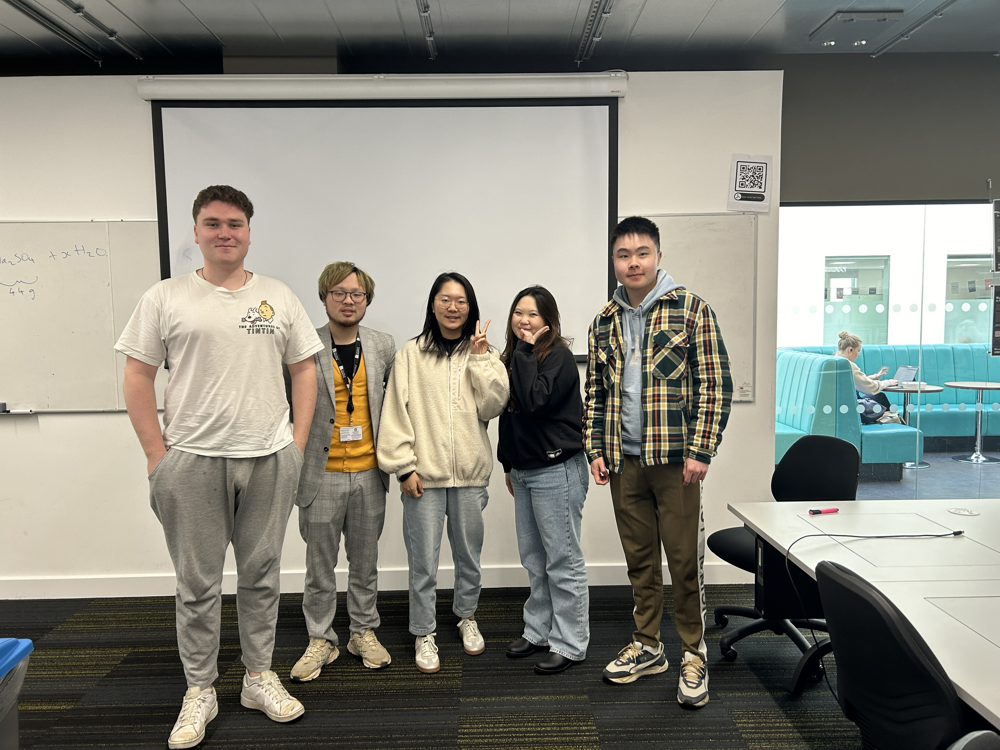

# Team

Weijian Li ,  me23202@bristol.ac.uk , LassonLi

Xinyue Feng , qg23773@bristol.ac.uk , XinyueFeng99 

Charmaine Suah , zx23187@bristol.ac.uk , Csuah09

Jamie Bell-Thomas , ws19177@bristol.ac.uk , jamiebellthomas

Hsuan Lin , ev23671@bristol.ac.uk , HsuanLin322

 

**User Stories**

>“As a << Developer>> I want to << have a twist in the gamel>> so that << the game is more fun and unique >>”

>“As a << User>> I want to << understand the game instructions >> so that << I can play the game intuitively >>”

>“As a << teacher>> I want to << be specific>> so that << I can mark the game accurately to the marking scheme >>”

>"As a << negative stakeholder>> I want to << find some bugs and difficulties in this game>> so that << I can provide some feedbacks for developers and earn money from them>>"

>"As a << original developer >> I want to << protect my intellectual property >> so that <<I can protect my property >>"

 