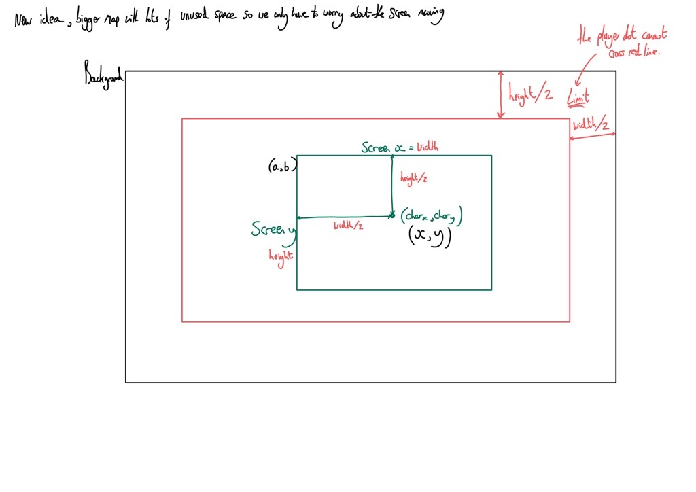
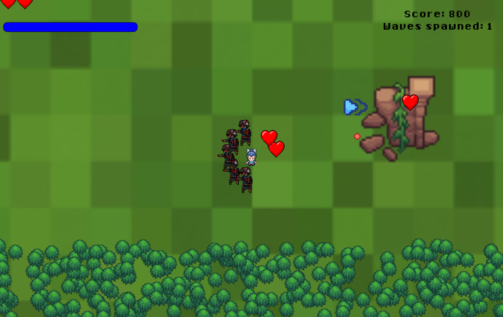
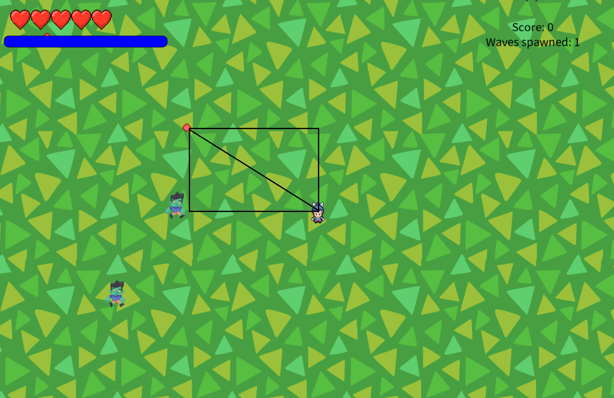

# 2024-group-19

### Team

L -> R: Jamie Bell Thomas, WeiJian Li, Xinyue Feng, Charmaine Suah, Hsuan Lin

Weijian Li ,  me23202@bristol.ac.uk , LassonLi

Xinyue Feng , qg23773@bristol.ac.uk , XinyueFeng99 

Charmaine Suah , zx23187@bristol.ac.uk , Csuah09

Jamie Bell-Thomas , ws19177@bristol.ac.uk , jamiebellthomas

Hsuan Lin , ev23671@bristol.ac.uk , HsuanLin322

## Introduction

In our single player roguelike survival game, the player takes on the role of a one-man army in a post-apocalyptic scenario, aiming to survive against waves of zombies using evasive techniques and power-ups that have a chance of spawning when you defeat an enemy. Our main character is moved through the manipulation of the ‘W’’S’’A’’D’ characters, with a continual stream of bullets shooting out of the character, whose trajectories are controlled by the position of the mouse. Players must be careful with the way they strategise to ensure they don't get trapped by the oncoming hoard. The game has 2 built in difficulty levels, and while there is no difference in the core mechanics between the levels, the harder setting creates a much more aggressive round structure, meaning enemies spawn more frequently, move faster, and are harder to defeat. The game is based off a mobile game “Suvivor.io" ([AppStore](https://apps.apple.com/sg/app/survivor-io/id1528941310) & [Google Play](https://play.google.com/store/apps/details?id=com.dxx.firenow&hl=en&gl=US&pli=1)). In this game, the user must fend off a continual onslaught of zombies to save their city. To make this game differ from it's inspiration we implemented 2 unique features. 

The first is an endurance bar that depletes when the player is moving and replenishes when they are stationary, creating an additional layer of strategy by forcing them to manage their endurance while safely navigating their way through the incoming waves of enemies. Our team found that this endurance bar idea managed to be both interesting and novel without hindering the quality of the game.

<figure>
  
  <figcaption>Demonstration of stamina mechanics</figcaption>
</figure>

The second was in-game power-ups that have a chance of spawning when an enemy is defeated. We found that these power-ups not only made the latter stages of the game more accessible, but also increased user satisfaction by making the game more stimulating. 

<figure>
  
  <figcaption>Demonstration of power-up collection and effects</figcaption>
</figure>

---

## Requirements

**Early stages design. Ideation process**

In inital stages of development, our group brainstormed about several types of games. Every team member introduced a game that he/she had researched prior to the meeting. Three members introduced their ideas that were similar to MATCH-3-GAMES. Another member introduced a 1v1 soccer game. The last member introduced a  a 2D-kill-zombie game. The majority opted for the survivor game through an anonymous voting system. It was selected because it offered a comparatively low minimal viable product requirement, while retaining ample room for overhead expansion into a more intricate game. Furthermore, the structure of the game leant itself to the concept of varying difficulty levels quite nicely. We started to discuss the basic functionality of the game. To better understand what ideas the users may be interested in, we started by creating some User Stories.

**User Stories**

>“As a << Developer >> I want to << have a twist in the game>> so that << the game is more fun and unique >>”

>“As a << User >> I want to << understand the game instructions >> so that << I can play the game intuitively >>”

>“As a << Teacher >> I want to << be specific >> so that << I can mark the game accurately to the marking scheme >>”

>"As a << Negative Stakeholder>> I want to << find some bugs and difficulties in this game>> so that << I can provide some feedbacks for developers and earn money from them>>"

>"As a << Original Developer >> I want to << protect my intellectual property >> so that << I can protect my property >>"

In the following weeks, we employed use-case diagram, user stories and use-case-specifications to set up initial requirements for our game. Using these requirements, we re-designed the paper prototype and recorded a video to depict how our game would flow. During which, we named our game "The Chase". Through the use of careful planning and communication, we then had a plan for how we wanted to implement the game moving forward.

<!--[survivor](https://www.bilibili.com/video/BV1Q4421F7zK/) -->

 

**Use-Case Specifications**

*Login use case*

>System shows: Login page display

>User input: login parameters

>System checks: checks the parameters with the existing users

> If login parameter exist, match the game login with their account. Else, show user another page for new log in / register account.

*Entered main page of game*

>Show the details of user’s game (levels/ existing highscore/ start game button )

>User inputs: 'enter' as start game button

>System shows: instructions of game, highlighting the instruction on the oxygen endurance bar, how to move and shoot and the aim of the game.

>User starts playing using WASD, and the automatic gun shoots through aiming with a mouse

>System creates: more zombies zoning into the user in waves

>Character continuously shooting bullet, moving around around according to the user’s mouse input

>Once moving and killed zombie, system display health decrease if user attacked by zombie. With continuous movement, the endurance bar will depleat and user will need to stand still to refill their endurance bar to move again. 

>System displays hp to be full (indicator of entering next level system needs to know that we need to go to next level). With more zombie kills, power ups relating to the weapons or health bar will randomly appear to help with user.

*Entered page of level 2*

>System display next level page

>System needs to reset the different bars

>Repeat until end of game, with enemies that are harder to kill, either by needing more hit damage to kill or enemy's health bar increases. 

*Entered page of win after level2*

>Show congratulation page:
>System displays high score onto the scoresheet
> If they are existing players, higher scores placed above previous scores. 
> First time players places their score in the middle, ighlight the current game score using border
>System shows: most recent 3 scores to show improvement or deprovement from previous games 

>System display back to original page showing the login

### Use-case Diagram

**Paper Prototype**
<figure>
  
  <figcaption>Paper prototype</figcaption>
</figure>

Click [here](https://www.bilibili.com/video/BV1Q4421F7zK/)to watch our Game Paper Prototype!

## Design 

Generally speaking, the game's architecture has 3 layers of granularity. 

### Entity Level
The first and most fundamental level is the entity level. Each instance at this level represents the physical state of a given entity whether it's an obstacle, an enemy or even the character itself. Attributes stores at this level usually include the (x,y) position, the speed, and image used to represent the entity. Methods stored at this level usually look at updating and rendering the position of entities where applicable. 
### Manager Level
The second level is the manager level. Each manager class is responsible for governing the collective behaviour of it's respective entities. Some examples of this are the EnemyManager class which handles the handles the incrementing difficulty of enemies that are spawnes and the BulletManager class which monitors all active bullets, removing those that have either had a collision, left the game world or gone off screen.
### Control Level
The highest level is the control level. This is the Main class in the script it's role is to continually call the update methods of each of the Manager classes. This pivotal role not only ensures the synchronisation of the various game elements but also facilitates the smooth progression of gameplay dynamics. This layered systems-based approach not only enhances the efficiency of game management but also contributes to the overall player experience, ensuring a seamless and immersive gameplay journey.

This structure is shown in the System Class Diagram below.
<figure>
  
</figure>

750 words 
System Architecture 
  - Class Diagrams
  - Behaviour Diagrams

---

## Implementation 

**Implementation**

**Challenges**
The 3 largest areas of challenges identified during the production of the game was: 1) planning and Implementation of a Dynamic Map; 2) creating an accurate shooting process using the mouse whilst making it efficient; and 3) the separation of enemies based on Particle Swarm Optimisation. These challenges were derived from the process of improving our game through our evaluative feedback.

1. Dynamic Maps
   
Originally, the game was was made up of entities moving around a static map, where all enemies converged on the characters potition. This created the immediate issue that entities could wonder off-screen and not be able to find their way back. However this was quickly fixed by establishing a simple coordinate boundary that limited all entity positions to within the area on-screen.

  Image below: User playing normally.
     
   Image below: User hiding off screen. 
    
   
However, a persistant piece of feedback that emerged through qualitative evaluations was that  the game could become more engaging with a larger map extending beyond the confines of the screen. Such an expansion would serve two primary purposes: fostering a sense of exploration and enabling the spawning of a greater number of enemies without overcrowding the map. Implementing this proved to be conceptually challenging. To do so, all entities, including the map and any onscreen obstacles had a set attributes representing their x,y coordinates. Entities that move such as the Character and enemies had these attributes updated on each iteration. From there, the Character was rendered in the middle of the screen and new set of x,y measurements were generated for each entity. These measurements represented their position relative to the Character, and therefore where they should be rendered, even if it off-screen. This presented an issue, when the player approached the edge of the map, the render of background would no longer fill the screen. To solve this, the original boundary condition was ammended to create a vertical and horizontal margain equal to the half the width and half the height of the screen respectively. This created an 'invisible barrier', so trees were rendered in this margain space to display that it was out of bounds. These ideas are shown in the diagram below:

Image below: Image of planning phase for dynamic mapping. 
  

 

Furthermore, to allow Users to play the game more strategically, we had implemented obstacles on the map. It can be used to orientate themselves of their location or used to hide away from the zombies. This was implemented using JSON files, which was populated with the different types, coordinates and dimensions of the obstacles.
  

2. Accurate and Effective Shooting

When we first completed the first rendition of our game, we noticed some issues with how the bullet was shooting. It was off centred, leaning towards the top left of the character. This was not what we had planned for as we wanted the bullet to originate and shoot out from the middle of the character.

After much trial and error to pinpoint exactly the reason that is causing the bullet to originate off centred, we realised that the image rendering from Processing has a corner imaging mode, as such we had to manually halved the width and height of the character as the co-ordinates for the bullets to originate from. This too allowed for the bullets to move flexibly as the character moved around the map.

Image below: reflects how bullet comes from the middle of the character in a straightline.
  

Furthermore, as the game was built on multiple loops that check the boundary of the character and the bullets, checks for the collision of the bullets with the enemies and the removal of bullets whilst having a constant loop to release the waves of enemies; the game was running very slowly. As such we had to make multiple changes. such as instantly deleting any bullets that were outside the window of the user’s perception to reduce the number of bullets to check for. Additionally, we kept track of the number of enemies that could be perceived by the user as a list and narrow down the global list of enemies to the perceived list, further lowering down the number of collisions to be checked for.

3. Particle Swarm Optimisation on Enemy Positioning

In early iterations of the game, enemies were allowed to overlap freely. This created an issue. With all enemies are trying to proceed to the same point on the map (the coordinates of the player), it became a common occurrence that they coalesced into a single entity, significantly detracting from the quality of the game. To combat this, we utilised a bio-inspired algorithm called Swarm Intelligence.
Swarm Intelligence is a mathematical representation of a sub-set of systems that exhibit emergent complexity, and one of its underlying behaviours is Separation, which ensures that the action space is delegated amongst the swarm’s agents.
To enforce this each enemy has a protected radius, and when other enemies enter that radius, it ‘steers away’ from them by calculating a deflection vector. This deflection vector represents the optimal direction of travel to avoid collisions with nearby objects, creating a separation between them.

   ---

## Evaluations
Stage 1 : mid-production evaluations

Think Aloud Participant #1:

Positives: fun game 

Negatives: There isn’t much fun or interesting movements to the character. Its not necessary for the character to move to play the game (but will die faster). Without prior experience of playing games on a keyboard, it might be hard to control the characters. Felt that the colour scheme of most elements in the game was too similar, causing it to be hard to see. Would enjoy a leaderboard to feature or saving of past scores for sense of improvement. Misunderstood that it is not necessary to click on the mouse to shoot. 

---

Think Aloud Participant #2:

Positives: good amount of challenging. 

Negatives: Unsure what stamina means. Felt that the background was too colourful and distracting from the enemy. When the enemy is too close to the character, the visuals of the bullet deteriorate. The font used for texts are too small and white makes it hard to see. Did not catch or fully grasps what the instructions were before starting the game. 

---
**Heuristic Evaluation** 

Based on the Heuristic Evaluation of the different game pages, we found that the issue regarding the design of the game was severely impacting the player's experience.

---
**System Usability Scale**

The final score was derieved and processed accordingly to their question number. Odd numbered questions had 1 subtracted from their scale score and mulitplied by 2.5 for the overall score. Whilst even numbered questions were subtracted from 5, before being multiplicated by 2.5 for the overall score. The processing of the SUS scores was completed over Microsoft Exel. 

---
**NASA TLX**

The NASA TLX questions were weighted by the users who underwent the TLX scoring and determined based on their opinions. Using the average weightage, it informed the final aggregate workload as sum of each individual score was multiplied by the question weightage before being divided by 15. The TLX scores highlighted that majority of the effort needed to play out game came from the performance of each player, the effort and their frustrations. 

---
**Insights**

Through analysing the data recorded from the qualitative and quantitative evaluations of the first stages of development, after we had our first viable product. 
We identified some key themes that guided our development onto the next stage for further improvement based on feedback. 
Key Themes:

- Poor colour scheme for text, characters and background.
- Need more clearer instructions on the game and have instructions be more accessible.
- Background and characters need more interactive features.

As such, the team underwent brain storming to further improve the game whilst using these themes as the basis for improvement. Together, we decided that we were going to change the background and include obstacles for the player to navigate. The screen will be further improved to make it dynamic, where the screen will follow the player, allowing for a larger map. Secondly, we will be making some design changes to the enemy and choosing a more distinct but complementary colour for the texts. Finally, include a help button where the player can access whilst playing the game to re-familiarise themselves with the rules.

---
Stage 2: Final evaluation 

The team held another SUS evaluation after redesigning the game. Changes to the design included a fixed font and colour throughout the game, change in ingame background and a menu button to remind users of the instructions and ability to exit the game safely. These changes aimed to help distinguish the text and the backgrounds to be more distinct and clearer, whilst maintaining an aesthetic 8-bit look to the game. 

**System Usability Scale**

**Wilcoxin Significant Testing** 

To evaluate if there was a significant difference in usability, the team used Wilcoxin Ranked test from on online W-test calculator. https://www.statology.org/wilcoxon-signed-rank-test-calculator/. We used the final System Usability Scale results of both Stage 1 (pre-design changes) and Stage 2(post-design changes) for the W-ranked test. 

We found that there was not a significant improvement in usability. With a T test score of 13 on 10 non-paired pairs, we needed a score of 8 to have a 95% certainty that the difference in usability was due to the changes rather than due to random noise. Whilst there is no significant difference in usability, in future rendition of the game, we aim to find different possibilities to implement on our design to further improve user usability. 

## Process ##

**Teamwork:**

Our team communicates via Teams to confirm the time and place for our meeting. When we do come together, we first look through our KanBan board to understand which tasks take priorityand writes a to-do list for that day. These tasks are usually delagated to different individuals accordingly to what they are better and more confortable with. With each task being ticked off, we gather the group to show the difference and impact it has on the game and remind each other to git-pull the new version of the repository. Our team usually stays in the meeting till everyone is mostly done with their tasks, before we decide on the next time we will meet and what tasks we are planning for the next meeting. These decisions are updated on the KanBan board and reiterated on the Team's chat. 

**Tools used:**

**Microsoft Teams** as a way for communication:
> Used to update each other on the progress and the work each of us did\
> Used to organise time and place for out next meet up

**GitHub** for version control:
> Made sure we only committed and push working code\
> Made sure our commit messages were helpful and discriptive

---

**Team Roles**:

Whilst every member played a role in contributing to the working code, prototyping ,ideation process and report writing, some members who had stronger coding skills had roles of being the team leaders in the code development and they delegated code work to the rest of the members. Some members took on roles of recording and keeping track of what tasks were completed during the meetings and updated the report to be as accurate as possible. While the rests of the members worked on the video presentation and sourcing of assets. 

**Reflection** 

Charmaine: 1.0

I feet that with all group work comes with friction and misunderstandings, but as this group has proven, with the joined mindset of providing the best product forward, we can all commit and work together to do our best. I am glad to have this group mates who are willing to put forward their best foot and help out the other teammates and I am grateful that the whole team was very involved in every stage of the process. 

XinYue: 1.0

I really enjoy the whole process of us figuring out the idea for the game. A lot of the initial design has to be modified during the process, and that is the chance we got to understand and practice agile development and teamwork. In the team, every member contributes their understanding of what makes the game work well and what makes it appealing to people. Therefore, we have a broader view of how to deliver a quality product. 

Jamie: 1.0

In this project my main area of responsibility has been the development of the source code. I played a key role in the development and testing of base mechanics of our game. Once a minimal viable product had been developed, I took a step back and restructured our code base, really focusing on the principals of agile object orientated design. This increased the readability and the performance of the code significantly as well as making it simpler to understand and further develop our game. More recently I have been working on higher level features such as the dynamic background as-well as the ‘power-up’ mechanics. Overall, I have thoroughly enjoyed working as a part of this team. I feel we have placed great emphasis on regular communication, creating a clear sense of direction for this team and allowing a wide variety of ideas to be considered. 

WeiJian: 1.0

During the whole process of game design, I find the agile development more important than the waterfall development since we just change our game continuously. For my job, I am responsible for coding the fundamental structure of our game. Although I finish the basic code at a early stage, our team wish to optimize the game to a top level. Therefore, all of us needs to reconstruct our code as well as adjust it to the new demand. It is not a easy process, but it is worth since the game becomes a better one.

LinHsuan: 1.0 

Upon discovering the task of designing a game in groups before the semester's end, I initially felt overwhelmed. However, through regular face-to-face group discussions and consistent effort, we are gradually overcoming obstacles and making progress.
In my role, I undertook game display design tasks such as creating game characters and designing instruction pages. Designing a good game is not easy. With each meeting, our collective vision becomes clearer, and our tasks more manageable. Our teamwork and dedication are paving the way for us to steadily close the gap towards achieving our objective.

### Conclusion ###
When we started the project, our team was extremely excited to create a new game that we could call our own. We wanted it to be fun, to look cool and for us to be proud of our production. Through our continuous hard work and commitment towards this project, we found that we have accomplished just that. This game has brought many challenges that we had to overcome, even starting from the basic of deciding how to format the game and to explore the different features processing was difficult. Furthermore, the challenges we found ourselves facing as we wanted to further improve the game, not only made us realise how important communication and independent learning was, but we also realised that working together as an agile team helped us bounce ideas and process information better. Looking back, whilst the main idea of the game still resides, we realised that game development is an ongoing process, and we need to remain flexible and open to new ideas. 

With the final product in hand, it might be easy to say that the entire process was smooth sailing, however key challenges the team faced was the need to refactor the game halfway through production. We found our code to be messy and the classes were unorganised. Aiming to allow the game to be as robust as possible, we decided to refactor the game over the Easter break. Majority of the production was held over those 3 weeks. Furthermore, whilst there were technical challenges that we faced during the game production. One of the challenges that blind sighted us was the design aspect. The team did not realise how big of an impact design has on a game, from making it look like an amateur production to something of better quality. Whilst our usability difference might not have been significant. We found that having a consistent look by using similar backgrounds, fonts, colour schemes, all made the game clearer and more professional. In future endeavours, we hope to have the time and ability to explore different ways to implement new enemies, each having their own skill to kill, and finding creative ways for the User to power up. Furthermore, in the future, the team feels that we could implement some scientifically informed user experience design to further improve the usability of the game, allowing for it to be second nature and easy to use. 

We would also like to use this space to thanks the different artists who gave them their permissions to use their different art works as assets. Other assets from artists who we were unable to contact were open sourced and available to use for school productions. 

Purple Zaffre: Assets for character [https://www.deviantart.com/purplezaffre]
TheStoryTeller01: Assets for zombies [https://www.deviantart.com/thestoryteller01]

Tyler Dunn: 8-bit Madness Font [https://www.fontzillion.com/fonts/tyler-dunn/8-bit-madness]

Forheksed: game background [https://www.deviantart.com/forheksed/art/Evening-in-the-coniferous-forest-603798203]

 

TODO : 

System Architecture 
  - Class Diagrams
  - Behaviour Diagrams

